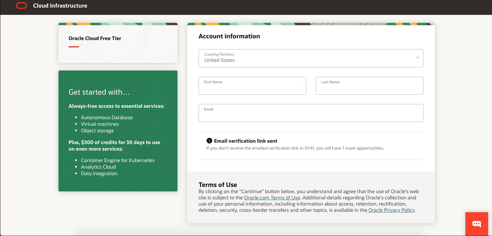
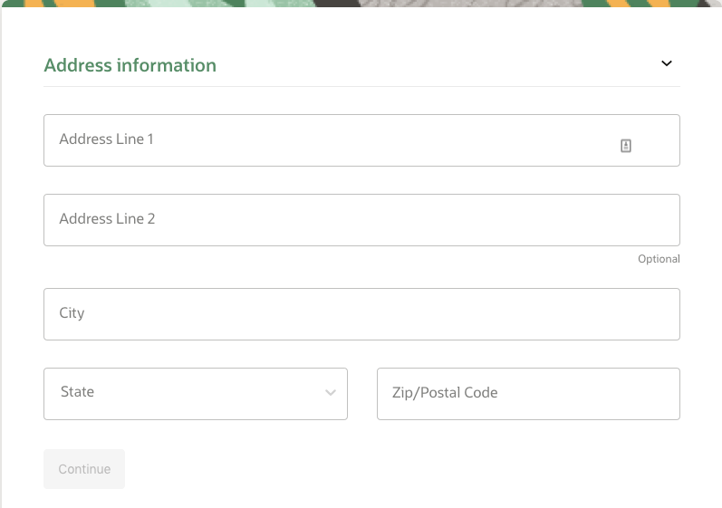

# Low Code eSports Analytics with Oracle Resource Manager and APEX 
Looking to gain a hands-on experience with Oracle technology? Look no further than the Formula Pi Demo Kit. In this lab, you'll deploy data ingestion infrastructure and Lowcode app through Oracle Resource Manager, configure your db connection, and personalize your front end dashboard by combining CSS and SQL. You'll also explore the use of Oracle's APEX tool to create a visually appealing and user-friendly dashboard for your eSports data. With its simplified development lifecycle and WYWASIG interface, APEX streamlines the development process, allowing you to focus on delivering a top-quality product that meets the needs of your users.

## FormulaPi kit lab structure:
The hands-on lab will take you through the following steps:  
        ***Lab 1*** - Deploying Infrastructure with Resource Manager  
        ***Lab 2*** - Setting up the Data Ingestion Engine  
        ***Lab 3*** - Exploring Data in APEX  

### Prerequisites

* An Oracle Free Tier or Paid Cloud Account
* [Familiarity with the OCI console](https://docs.oracle.com/en-us/iaas/Content/GSG/Concepts/console.htm)

## Task 1: Create your Free Trial Account

If you already have a cloud account, skip to the **Get Started** section.

1. Open up another browser window or tab to access the Oracle Cloud account registration form at [oracle.com/cloud/free](https://signup.cloud.oracle.com/)

    You will be presented with a registration page.

    

2. Enter the following information to create your Oracle Cloud Free Tier Account.

    * Choose your **Country**

    * Enter your **Name** and **Email**

3. Once you have entered a valid email address, select the **Verify my email** button. The screen will appear as follows after you select the button:

    

4. Go to your email. You will see an account validation email from Oracle in your inbox. The email will be similar to the following:

    

5. Click the link (if possible) or copy and paste the link into your browser.

6. Enter the following information to create your Oracle Cloud Free Tier account:

    * Choose a **Password**

    * Enter your **Company Name**

    * Your **Cloud Account Name** will generate automatically based on your inputs. You can change that name by entering a new value. Remember what you wrote.  You'll need this name later to sign in.

    * Choose a **Home Region**. our Home Region cannot be changed once you sign-up.

    * Click **Continue**

    

7. Enter your Address information and click **Continue**

    

8. Choose your country and enter a mobile number for verification. Click the **Text me a code** button.

    

9. Once you receive your code, enter it and click **Verify My Code**.

    

10. Click the **Add payment verification method** button.

    

11. Choose the verification method. In this case, click the **Credit Card** button. Enter your information and payment details.

    **_NOTE:_**This is a free credit promotion account. You will not be charged unless you elect to upgrade the account.

    

12. Once your payment verification is complete, review and accept the agreement by clicking the check box. Click the **Start my free trial** button.

    

13. Your account is provisioning and should be available soon! You might want to log out as you wait for your account to be provisioned. You'll receive two emails from Oracle: one will be the initial notification that provisioning is underway, and the second one will be about provisioning finishing up:

    

  

## Acknowledgements
* **Author** - <Wojciech Pluta, Immersive Lead, DevRel>
* **Contributors** -  <Jason Lowe, Oracle>
* **Last Updated By/Date** - <Name, Month Year>
