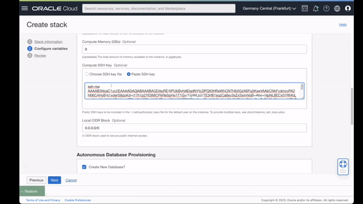
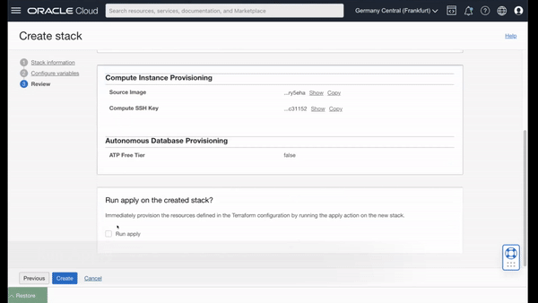

# Backend deployment with Oracle Resource Manager

## About this Workshop

In this workshop, we will focus on setting up the backend infrastructure for our game data.

### Objectives

In this workshop, you will learn how to:

* Configure and deploy custom stack using Resource Manager
* (Optional) Execute the Liquibase in OCI Shell

Estimated Workshop Time: 20 minutes

### Prerequisites

This lab assumes you have:

* An Oracle account

## Task 1: Deploying Stack with Oracle Resource Manager

1. Click [](https://cloud.oracle.com/resourcemanager/stacks/create?region=home&zipUrl=https://github.com/oracle-devrel/FormulaPi_Lab1_deployment/releases/download/v1.0/f1-simulator-tf.zip)

   If you aren't already signed in, when prompted, enter the tenancy and user credentials.

2. Add your SSH key


You can generate one using following commands

* Open to your .ssh folder for example:
      `cd /home/user_name/.ssh/`  
      `ssh-keygen -b 2048 -t rsa`
* Enter file in which to save the key (/home/user_name/.ssh/id_rsa): _dataingestion_  
* Run:  
          `cat dataingestion.pub`  

## Task 2: Configuring the Stack

1. Review stack information, make any desired changes to user and password, then press _Next_.


## Task 3: Executing Plan/Apply

1. Run the _Plan/Apply_.


You may now **proceed to the next lab**

## (Optional Task) Intro for Liquibase

Liquibase is a powerful database management tool that allows developers to easily manage and manipulate databases through a simple and intuitive interface. This tool is primarily used in the context of software development, and allows for efficient and streamlined database management, including tasks such as creating, updating, and deleting tables, as well as inserting, updating, and retrieving data.

One of the key features of Liquibase is its ability to handle complex data structures and relationships, making it well-suited for use in large and complex software projects. Additionally, it supports a wide range of database management systems, including MySQL, PostgreSQL, and Oracle, making it a versatile tool for developers working with a variety of different databases.

Another important aspect of Liquibase is its ability to handle database migrations. This means that it can automatically update the database schema as the software evolves, ensuring that the database remains in sync with the codebase and minimizing the risk of errors or data loss.

In summary, Liquibase is a powerful and versatile tool that simplifies the process of managing databases, making it an essential tool for any software developer. It allows for efficient management of complex data structures, supports a wide range of database management systems, and handles database migrations seamlessly. It's a great tool for those who are looking to streamline their development process and improve the efficiency of their software projects.

## (Optional Task) Accessing DB Wallet in Cloud Shell

Cloud Shell
Copy OCID of of the Authonomous db
in Shell  
          ```
          <copy>export ADBID =<paste your DBOCID here></copy>
          ```

Now set the name of the wallet as environment variable  
          ```
          <copy>export WNAME=wallet.zip</copy>
          ```

Lets now generate a wallet password as environment variable  
          ```
          <copy>export WPWD=<add your password here></copy>
          ```

lets run following to create a db connection with wallet and wallet password
          ```
          <copy>oci db autonomous-database generate-wallet --autonomous-database-id $ADBID --password $WPWD --file $WNAME</copy>
          ```

Finally, let connect to our db using
          ```
          <copy>sql -cloudconfig $WNAME simuser@<dbname>_low</copy>
          ```

To deploy the table, run the following command, specifying the path to the changelog file:
          ```
          <copy>liquibase --changeLogFile=changelog.xml update</copy>
          ```

You can also use the liquibase status command to see the status of the schema at any time
          ```
          <copy>liquibase --changeLogFile=changelog.xml status</copy>
          ```

## Acknowledgements

* **Author/Contributors** -  Stuart Coggins, Wojciech Pluta, Jason Lowe
* **Contributor** - Oracle LiveLabs Team
* **Last Updated By/Date** - <Wojciech, 05 2023>
